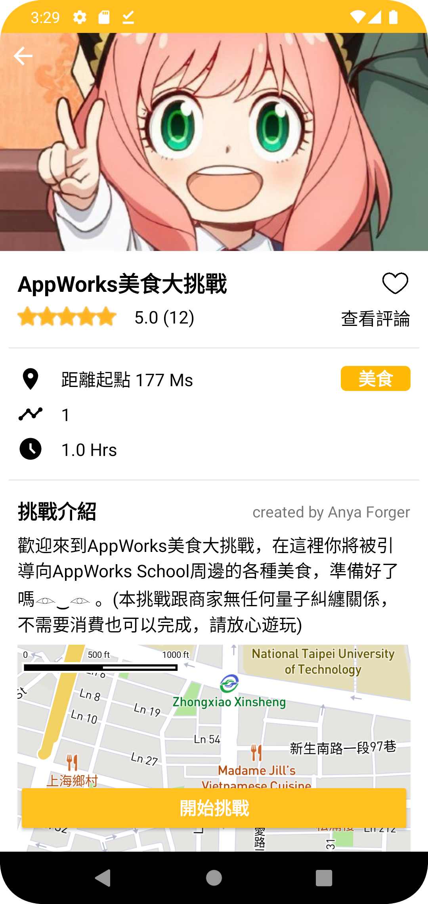

# **MiruHiru** 
**MiruHiru** is a multiplayer travel challenge App, users can explore the story and features of attractions through challenges on the MiruHiru map or create their own challenges to share with everyone.
[<div style="text-align:center">
</div>](https://play.google.com/store/apps/details?id=com.neil.miruhiru)

## **Features**
---
+ ### **Exploere New Challenges**
    You can find different types of challenges on the MiruHiru map, find what you are interested in and play with friends.

    ### **> explore**
    <div>
    
    
    
    
    </div>

    ### **> start challenge**
    
    <!--  -->
    
    
    <!--  -->
    
    <!--  -->
+ ### **Custom Your Challenges**
    Customize your own challenges to share with friends and you can also re-edit those completed challenges.

    ### **> customize**
    <div>
    
    
    
    
    </div>

    ### **> re-edit**
    <div>
    
    
    
    
    </div>

+ ### **Share to Community**
    Share your perfect challenges to the community for all MiruHiru users to participate

    <div>
    
    
    
    
    </div>
+ ### **Profile**
    See everything about your account here, including reviewing the records you left during the challenge, finding your favorite challenges, joining challenge through scanning QR Code and checking notifications.

    <div>
    
    
    
    
    </div>
## **Technical Highlights**
---
+ Implemented the **MVVM** architecture and **Repository Pattern** to improve the readability 
and maintainability
+ Applied **MapBox Maps SDK** and connected with **MapBox Geocoding API** to realize map presentation and location search
+ Tracked user location and calculated the distance between the user and their destination through **Google's Fused Location Provider**
+ **Customed MapView touch event** to solve the scrolling conflict between MapView and ScrollView
+ **Customed callback** to solve RecyclerView notifyItemRangeChange and moving item animation conflict and increased moving fluency
+ Combined **ViewModel** and **Fragment Result API** to pass data between fragments
+ Updated and retrieved real-time data through **Firestore SnapshotListener**, and successfully enabled the travel challenge to be played in a **multiplayer mode**
+ Stored challenge progress and editing progress in the **Cloud Firestore**, allowing users to temporarily exit or synchronize data between multiple devices
+ Applied ZXing Android Embedded and Code Scanner to accomplish scan **QR Code** to join travel challenge feature
+ Integrated **Google Sign-In** to achieve quick sign-in flow and increase user experience

## **Test Accounts**
---
General accounts will be limited by the distance of 30 meters to start the stage task when they are in the process of challenges. Using a test account can remove this restriction and has the ability to verify users' custom challenges as well.
Account | Password
--------|---------  
miru112822@gmail.com | miruhiru112822
hiru112822@gmail.com | miruhiru112822
## **API Keys**
---
To run this project, you will need to add the following tokens to your **local.properties** like below.  
You can get tokens from Mapbox website, checking [**Mapbox Documents**](https://docs.mapbox.com/android/maps/guides/install/) for more Details.
```
sdk.dir=C\:\\Users\\user\\AppData\\Local\\Android\\Sdk
mapbox.access.token="your mapbox public token"
mapbox.download.token="your mapbox secret token"
```
## **Requirment**
---
### Android SDK 26  
Gradle 7.3.3
### **Version History**
---
Version | Date
--------|------------
1.0.7 | 2022/12/14
1.0.6 | 2022/12/7
1.0.5 | 2022/11/28&ensp; (App Released)
1.0.3 | 2022/11/21
1.0.2 | 2022/11/14
1.0.1 | 2022/11/7

## **Contact**
---
Linkedin : https://www.linkedin.com/in/neil-tsai/  
Email : tsaichenghan999@gmail.com
